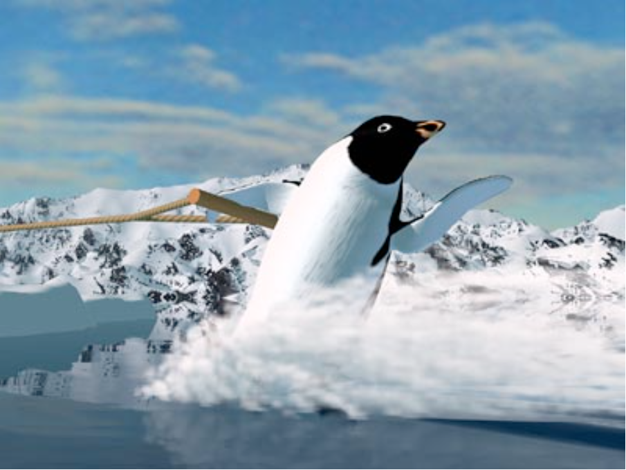
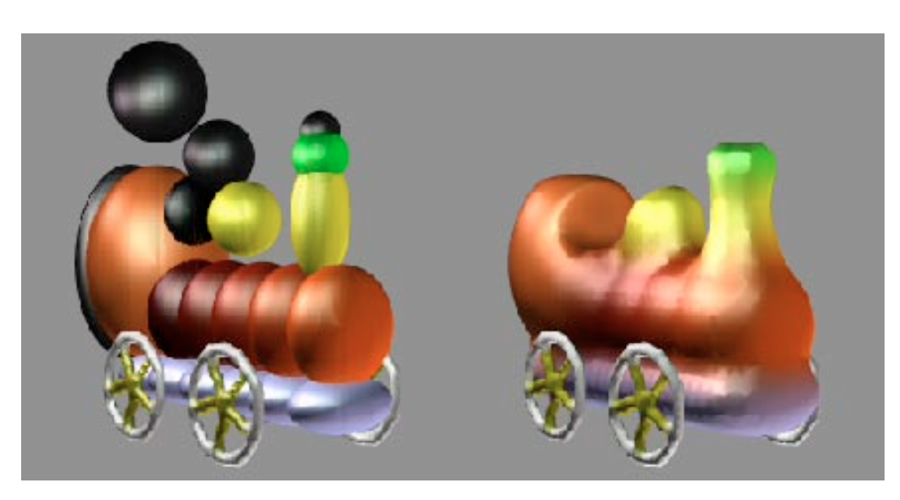

# README

Beautiful abominations from groundbreaking computer graphics research.

My new favourite piece:
*Dino's Lunch* by Andrew Glassner, 1988. A raytraced 64 frame animation using quadric surfaces.

 Also featured as the Cover of the 1088 Edition of the IEEE Computer graphics and applications:

Reconstructed animation:

---

