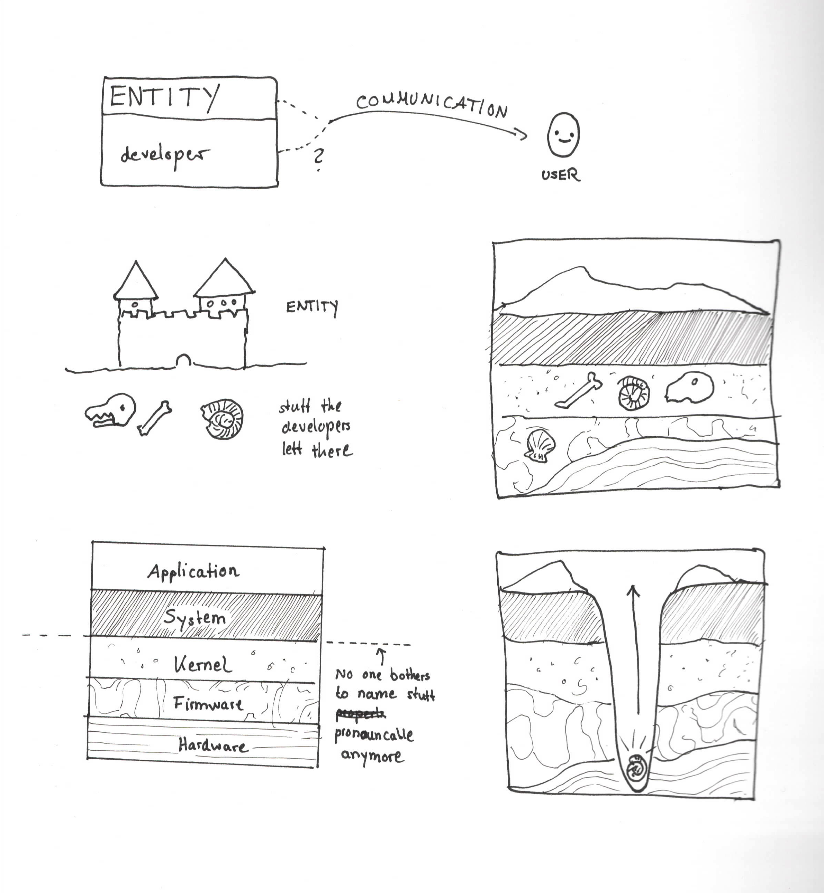

# Your PC as an archeological site

Lets's assume we turn on logs for the booting procecss of Mac Os, which is a perfectly fine computern task. On shutdown, we are presented with these (Open question: is it somehow possible to make a screenshot of a shutting down pc?):

 

 The question arises: who is talking here: the PC? Or some person at Apple that has had a long day too and went hme afterwards?

 

- Proposal for Apple: please include Shutdown-screenshot hardware in your stuff.