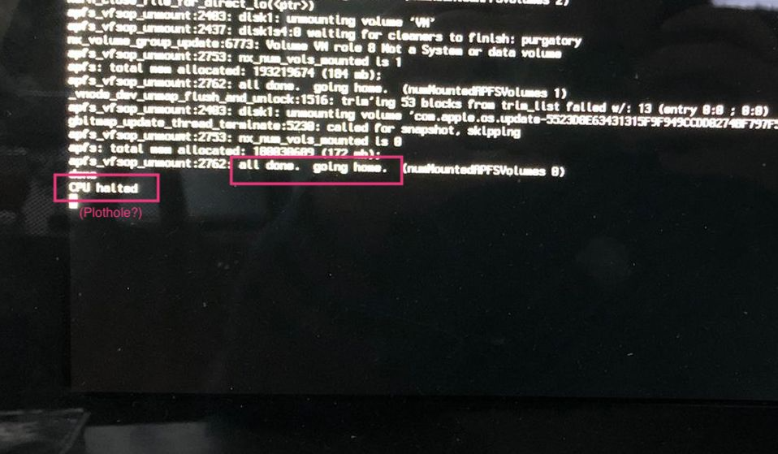

# Your PC as an archeological site

## A message from the developers?

Lets's assume we turn on logs for the booting procecss of Mac Os, which is a perfectly fine computern task. On shutdown, we are presented with these (Open question: is it somehow possible to make a screenshot of a shutting down pc?):

 

 The question arises: who is talking here: the PC? Or some person at Apple that has had a long day too and went home afterwards?

 

- *For these occasions, let's hope that Apple considers adding a dedicated shutdown-screenshot hardware module to their devices. We've cleary proven the demand is there.*

## 