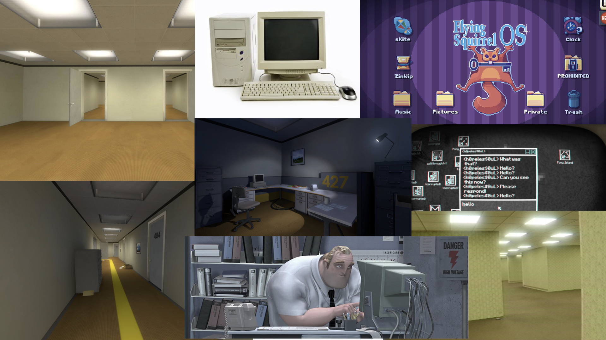

# Delightful Joy or existential anxiety? Computern in Indie Games

While trying to define what *Computern* is actually supposed to mean, it was worthwhile to specifically have a look at Independent Video Games that feature either the interaction with a computer as a game element.

The image below shows an early moodboard featuring footage from Video Games that specifically use Desktop computer interfaces as Game mechanics (Such as *Daniel Mullins' Pony Island* or *There is no Game*) or deal with the absurdity and surrealness of modern office jobs in wich dektop computers and machinic tasks are omnipresent and to some extent, modern life in general. In the *Stanley Parable*, the player initially embodies an office worker in an unspecified business whose job involves utilizing his computer in a way that closesly resembled *Computern*, such as pressing keys on the keyborad for no apparent reason. The monotony and pointlessness these tasks is exaggerated to the point of hilariousness. Additional footage that visually fits this mood such as the classic *beige box* desktop computer was added.

However, in the aforementioned games, the absurdity of their scenarios also invokes a sense of eariness, giving them a more dark humorous spin. Something feels *off*, and the narratives of these games either directly state or imply that the player's actions are guided by some kind of non-human entity with motives that are unknown or unknowable to the player. In *Pony Island*, the Arcade machine whose Graphical user interface is the main scene of the game is an openly malicious entity the player literally sold their soul to, while *There is no Game* features the game itself as a character that tries to prevent the player from opening it. All example have in common that they are breaking the fourth wall, as their stories acknowledge the player's existence outside of the game while denying them full control over what is supposed to be 'their' game. This certainly opens a door for a good dose of existential anxiety while still having fun at the same time.

*A moodboard for darker associations with Computern: screenshots from the Stanley Parable (Galactic Cafe, 2013), There is no Game: Wrong dimension (Draw me a pixel, 2020), Pony Island (Daniel Mullins, 2016), The Incredibles (Pixar, 2004) and a visual representation of the 'Backrooms' urban legend*

With these associations in mind, I came to the conclusion that *Computern* as a project overall should have a different flavour: especially since the original motiviation for this project might actually be a serious one, I wanted to present the act of finding humor in the pointless act of utilizing a technical devices functionality for its own sake in a delightful way that leaves any cynical interpretation up to the viewer. 
