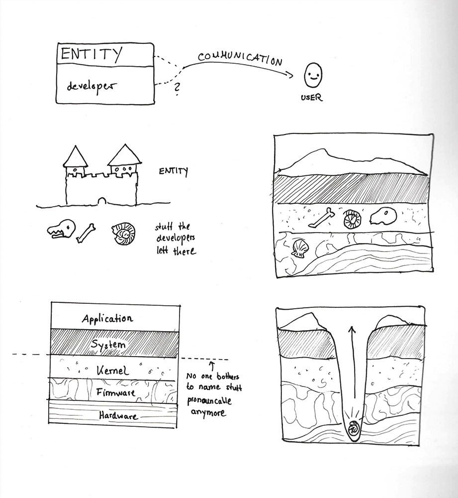
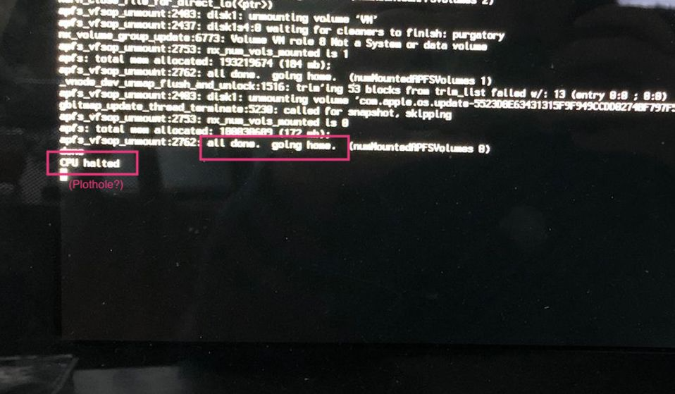
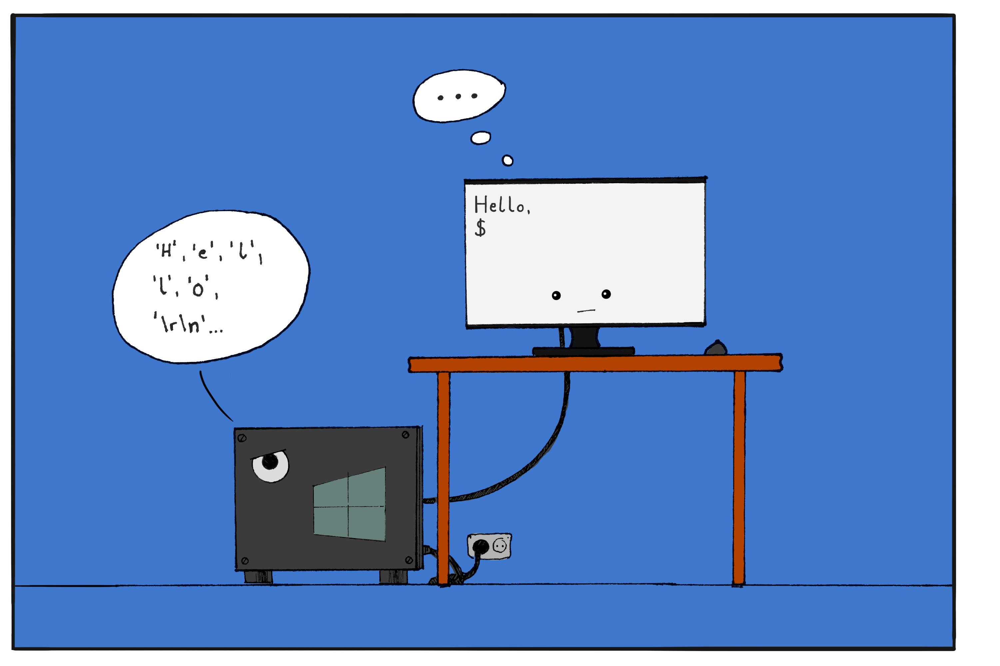

# Your PC as an archeological site

As users, we are rarely confronted with the deeper layers of our trusted computing systems. Which is of course fine since at some layer of abstraction, processes one encounters start to bear catchy names such as *as.vit9696.VirtualSMC* or *snd_page_alloc* which might or might not serve as verbal mimicry to keep off potential human threats to the system's integrity should they ever come across. In short, as end useres, we are typycially not meant to catch anything from lower layers of the system.
This greatly contributues to that mysterious black box aura that surround computers – and  makes it all the more interesting when occasional fragments get washed up from deep down to the surface.

 

## A message from the developers?

Lets's assume we turn on logs for the booting procecss of Mac Os, which is a perfectly fine computern task. On shutdown, we are presented with these (Open question: is it somehow possible to make a screenshot of a shutting down pc?):

 

 The question arises: who is talking here: the PC? Or some person at Apple that has had a long day too and went home afterwards?

- *For these occasions, let's hope that Apple considers adding a dedicated shutdown-screenshot hardware module to their devices. We've cleary proven the demand is there.*

## Charming relics of the past

A peculiarity of any Version of the Windows Operating System is that when writing text, line breaks are encoded as two special characters (ASCII codes 13 and 10, displayed '\r\n'). This encoding is truly an ancient relic that got preserved through time: Windows ancestor MS-DOS did not feature device drivers while electromechanical teleprinters were still a legitimate poutput device. Hence it was the system's job to tell potentially connected teleprinters to return their printing carriages at the end of a line. For compatibility reasons, this encoding was kept in subsequent versions of Windows up until today [1].

---

*"…I really have no idea what this 'teleprinter carriage' is supposed to be, but as long as Computer is happy I'm not complaining"*

---
Sure, the text might now be typed in a cloud based web application in one of 38 parallelly opened browser tabs - which makes the image that the same system to this day faithfully reminds the connected 4k monitor to return its teleprinter carrige with every new line somewhat heartwarming.

- [1] Dylan Beattie: *Plain Text* - NDC Oslo 2021, online: https://www.youtube.com/watch?v=_mZBa3sqTrI